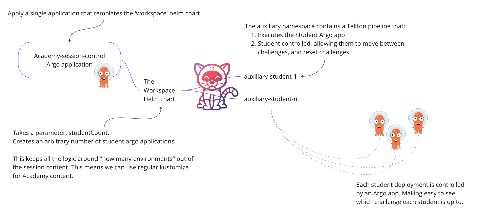

# Headsail

Headsail is a training environment made of OpenShift components that enables users to practice OpenShift without the risk of affecting production. It has two main components: Workspace, which creates student auxiliary namespaces containing pipelines triggering each challenge rollout, and the content directory, which contains Academy session materials.

There are few one off cluster setup tasks described in [Docs](Docs), once complete starting session control using the `Application` artefact.



```
oc apply -f academy-session-control.yml
```

There is a single parameter to adjust the number of student environments. Modify `studentCount` to suit your situation.
 
```
  source:
    repoURL: https://github.com/lijcam/headsail.git
    path: ./workspace
    targetRevision: HEAD
    helm:
      valueFiles:
        - ../content/sessions/session-1.yml
      parameters:
        - name: studentCount
          value: "2"
```

The student apps can be cleaned up using the `headsail.student-id` label.

```
oc delete applications -n openshift-gitops -l headsail.student-id
```


## Known Issues

- Currently unable to deploy clusterwide resources from the content directory.