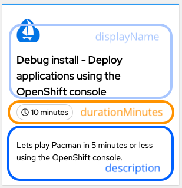
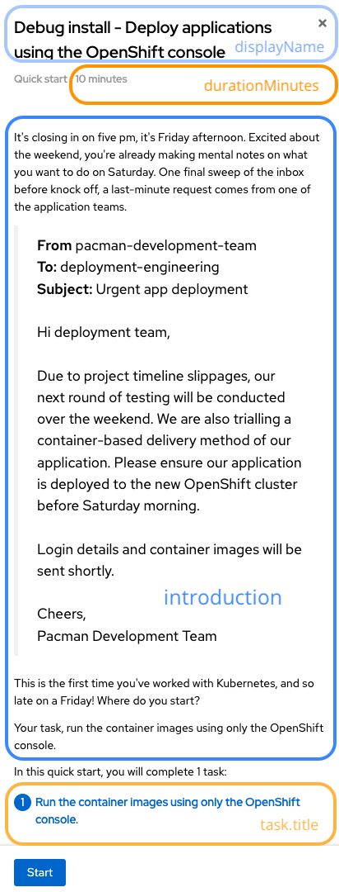
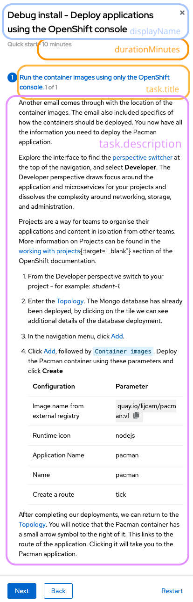

# Sessions

A session is a collection of challenges that you can run. To select a specific session, update the `source.helm.valueFiles` field in the `academy-session-control.yml` file.

Here's an example of how to specify the session in the YAML configuration:


```
source:
  repoURL: https://github.com/lijcam/headsail.git
  path: ./workspace
  targetRevision: HEAD
  helm:
    valueFiles:
      - ../content/sessions/kubernetes-101.yml
```
The path specified is relative to the `workspace` directory. It's important to include the back reference (`..`) as shown in the example above.

The `sessions` directory contains several pre-built sessions. If you want to create a custom session, continue reading. Please consider committing the session back via a pull request.

## Creating sessions
The two main components of a session are the technical content (deployments, containers, etc.) and written instructions. We use Quickstarts to publish written content into the cluster.

You can use existing sessions as templates or review the [values file](../../workspace/charts/quickstart-chart/values.yaml) of the session's Quickstart Helm chart for a simplified example.

During the development of a new session, you can quickly validate the YAML representation and the rendered template by running the `validate-quickstart-helmchart.sh` script in the `tests` directory. This script will print the YAML or any errors encountered during templating. If you are already logged into an OpenShift cluster, it will also install the Quickstart, which will be immediately updated in the browser.

To run the validation script, use the following command:

```
./tests/validate-quickstart-helmchart.sh
```

### Challenges

Challenges describe the required deployments, containers, and other elements that should be deployed into a student's namespace. A typical session may include up to three challenges. The challenges are defined as follows:

```
---
challenges:
  - content/challenges/challenge-1
  - content/challenges/challenge-2
```
### Session information

The session information includes the display name, description, duration in minutes, and an introduction. Here is an example:

```
displayName: Friendly name for the session
description: What are we trying to acomplish in this session.
durationMinutes: 10
introduction: |-
    We use multiline markdown. 
    You can also use various HTML tags.
    We can also highlight features of the Console, for example, [perspective switcher]{{highlight qs-perspective-switcher}}.


```
These sections should be self-explanatory. Note that using multiline markdown in the instruction field simplifies code review.



The above image shows a quickstart tile that includes the key elements mentioned. Additional examples of how quickstarts are rendered in the OpenShift console can be found at the end of this document.

Quickstarts support advanced markdown, HTML, and JavaScript functions. For more information, refer to the [okd documentation](
https://docs.okd.io/latest/web_console/creating-quick-start-tutorials.html#quick-start-highlighting-reference_creating-quick-start-tutorials).

### Session tasks

Tasks within a session have titles, descriptions, review instructions, and summaries. Here is an example:

```
tasks:
  - title: Friendly name for the task.
    description: |-
      We use multiline markdown.
    review:
      failedTaskHelp: This task isn't verified yet. Try the task again.
      instructions: |-
        #### To verify the application was successfully created:
        1. Do you see a **mongo** deployment?
        2. Do you see a **pacman** deployment?
    summary:
      failed: Try the steps again.
      success: You have deployed the Pacman application!
```


